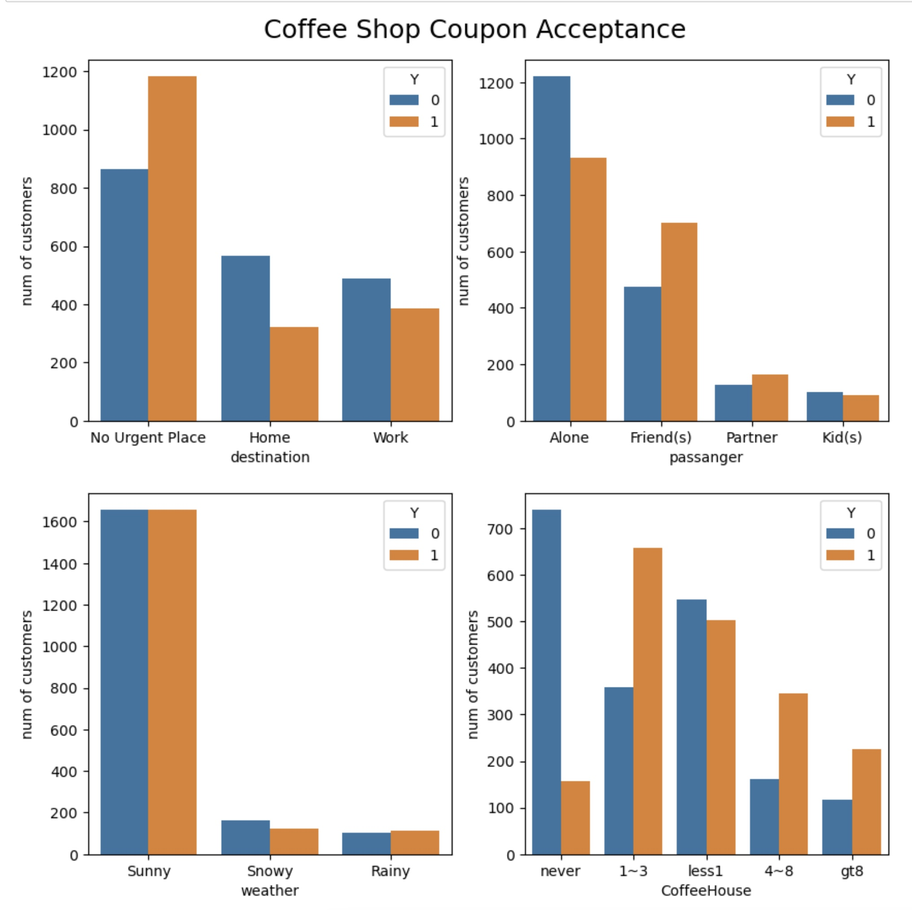

### Link to the Notebook

[Practice Application Assignment 5.1](https://github.com/lis-assignment/Practical-Application1/blob/main/practical_application_5.1.ipynb)   

## Coupon acceptance analysis   
   
#### Overall review
* In this analysis, we test the overall acceptance rate and the individual case such as Bar coupon and coffee shop coupon difference
* The overall acceptance of all coupon is `56.84%` while the coupon for Bar acceptance rate is only `41.19%`
* For the coffee shop the overall acceptance rate is `49.57%`   
   
   
#### Bar coupon feature   
* there are totally 1906 samples in this bar review, while 785 customers will accept the coupon
* the customer who went to the bar more than 3 times a month, their acceptance rate is almost 2 times of the one who went to the bar less than 3 times
* Customer over 25 will more often accept the coupon, their rate is `68.98%`
* Customer rarely took kids to the Bar, if their passengers involves kid, they highly refuse the coupon while the customer without the kids, their acceptance rate can reach as high as `70.94%`
* Customer who prefer goes to cheap restaurant has lower acceptance rate, their acceptance rate is as low as `45.64%`

#### Coffee shop feature
* We take coffee shop as our independent investigation
* Coffee shop has lower coupon acceptance rate while the overall rate is `56.84%` but coffee shop only has `49.57`
* there are 3809 samples in this dataset while only 1888 customer choose to accept the coupon.
* Customer who accept the coupon cares more about
  * weather conditions
  * with a friend or not
  * if they don't have urgent plan
* Customer never go to the coffee shop has high percentage refuse the coupon while cusomer with more than 1 visit will accept the coupon
* These kind of customer their acceptance rate can reach to `69.24%`

   

#### Future Work
* I am going to explore the other group of customers such as  Carry out adn Restaurant
* I am also going to figure out which key feature affect them the most

